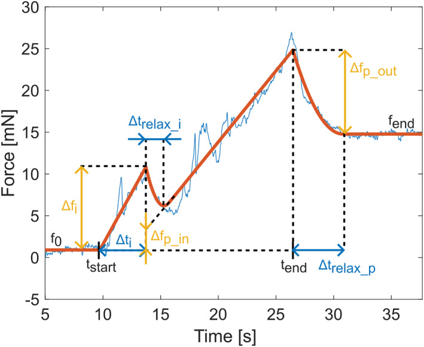
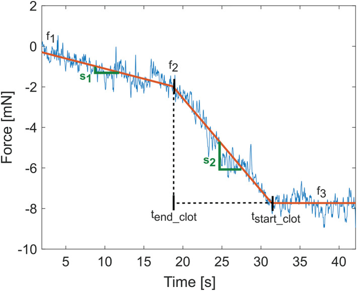

# Possible other sources to look at
- Skyrman et al. 
- Sensome company

# Experimental Setup
## Equipement
### Wires
- 0.36 mm diameter guidewire
- 0.53 mm inner diameter catheter
### Arterial model
- Arterial model + pump for water in arteries
- 100 mm long
- taper angle1 degree
- distal diameter 2 mm 
- (avergae diameters of the most commonly occluded large vessels in acute stroke) 5 to 3.6 mm
- M1 and M2 averages 3.1 to 2.4 mm 
- ICA taper 0.04mm / 1mm
- M1 taper 0.03mm / 1mm
- Model taper 0.35 mm / 1mm
### Clot
TODO
### Robotic device
- 1 DoF
- force signal sampled at 1 kHz

## Experiments
### Forward / Penetration
- clot inserted -> pressuried to reach stable position
- catheter place 1mm away from edge of the clot
- distal end of guidewire 10 mm inside catheter -> measure baseline force
- wire moved forward 1mm/s
- movement stopped at 10-15 mm after the end of the clot.
### Backward measurement
- retrieve wire 1mm/s
### Controls
- 3 measurements without clots for each experimental sessions
## Type of experiements
### Stiffness influence
- pressure fixed at 120 mmHg
#### 3 types of clots
- stiff (4mm), soft (6mm), very soft (7mm), length 5mm
#### Same quantity of material
- vary both initial diameter and the length -> same posiiton in the model and same volume
- compare stiff and soft
### Insertion pressure influence
- pressure 60 mmHg (stiff clots) - and 120 mmHg (soft clots)
- size selected to reach same position (5X6 mm soft and 3.5X9mm for the stiff, dimXlength)

## Data Analysis

### Start/End clot events
- from recorded images 
### Force sensor voltage
- processed with average moving filter (window = 100ms)
- to mN through calibration curve of force sensing unit
### Average forward/backward force profiles
- 5s before and T seconds after True start (for forw) and True end (for backw)
- T depends on the length of the clot
- baseline removed -> signal starts at 0mN
### Maximum force in clot
- obtained between 5s before and T 
- baseline subtracted
### Delta force
- difference between average force level beyond the clot and the baseline level before the clot
- for forward beyond clot = once force converges
### Average force slop in clot for backward measurement
- filtered with 3rd order lowpass Buterrword filter cutoff frequency 0.5 Hz
- slope and avergae value between True end and True start calculated
### Clot volume in the arterial model
- used a ruler to measure Rprox, Rdist and Lin
$$
V_{in} = 1/3 *pi* L_{in}(R^2_{prox} + R_{prox}R_{dist} + R^2_{dist})
$$

## Statistics
- Wilcoxon rank sum test for two groups
- Kruskal-Wallis with bonferonni for more than 2 groups

## Tip detection
- segement the tip 
- compare to ruler on the same image
- if it doesn't work -> human intervention

# Model
- Curve fitting of the frce signal using contrained non-linear multivariable function optimisation
- two different model are used for forward and backward
- -> detect start and end from model parameters

## Foward model
- inspiration Fregonese and Bacca
Steps : see paper

## Backward model
- simple constant slope curve beyond the clot and another slope within the clot and a plateau after the detected start

## Length
- length is calculated from end and start measurements

# Results
- 104 trials included
- given 1mm/s 1 s. error is ~ 1m error
- accuracy defined as +- 1.5s. or +- 1.5mm
- Space
    - Start detection
        - 86.5% forward model
        - 60.6% backward model
    - End detection
        - 69.2% forward
        - 71.2% backward
- Time
    - Start detection
        - 85% forward model
        - 56.7% backward model

- 1.71s. to fit forward
- 0.76s. for backward
- Length -> +- 3s. +- 3mm (76.9% forward, 69.2% backward)